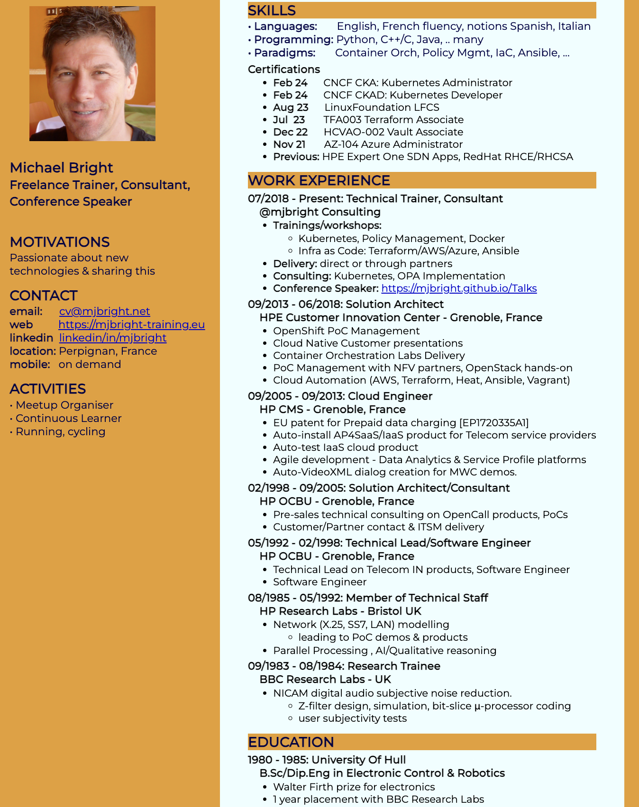
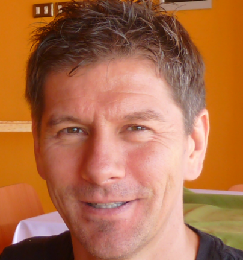


<a class="btn btn-lg btn-secondary me-3 mb-4" href="cv.pdf">
    [English] CV Download <i class="fa-regular fa-newspaper"> </i>
</a>



{}

{}

{}
 
 
 
 

 
<h1 class="name">
<strong> Michael Bright </strong>  

<strong>Freelance Trainer, Consultant, Conference Speaker </strong>

</h1>

 
<h2 class="supertitle"> MOTIVATIONS </h2>

Passionate about new 
technologies & sharing this 

<h2 class="uppertitle"> CONTACT </h2>

<b>email:</b> &nbsp;&nbsp;&nbsp;&nbsp; <a class="cv" href="mailto:cv@mjbright.net">
cv@mjbright.net </a>  
<b>web</b> &nbsp;&nbsp;&nbsp;&nbsp;&nbsp;&nbsp;&nbsp; <a class="cv" href="https://mjbright-training.eu">
https://mjbright-training.eu </a>  
<b>linkedin</b>&nbsp; <a class="cv" href="https://www.linkedin.com/in/mjbright/" target="_blank">
linkedin/in/mjbright </a> 
<b>location:</b>
Perpignan, France  
<b>mobile:</b>&nbsp;&nbsp;
on demand

<h2 class="uppertitle"> ACTIVITIES </h2>

• Meetup Organiser 
• Continuous Learner  
• Running, cycling  

<h2 class="uppertitle"> SKILLS </h2>

<b> • Languages:</b> &nbsp;&nbsp;&nbsp;&nbsp;&nbsp; English, French fluency, notions Spanish, Italian  
<b> • Programming:</b> Python, C++/C, Java, .. many  
<b> • Paradigms:</b> &nbsp;&nbsp;&nbsp;&nbsp;&nbsp;
Container Orch, Policy Mgmt, IaC, Ansible, ...  

<h3 class="title"> Certifications </h3>
<ul>
<li> <b>Feb 24</b>&nbsp;&nbsp;&nbsp;&nbsp;&nbsp; CNCF CKA: Kubernetes Administrator </li>
<li> <b>Feb 24</b>&nbsp;&nbsp;&nbsp;&nbsp;&nbsp; CNCF CKAD: Kubernetes Developer </li>
<li> <b>Aug 23</b>&nbsp;&nbsp;&nbsp;&nbsp;&nbsp; LinuxFoundation LFCS </li>
<li> <b>Jul &nbsp;23</b>&nbsp;&nbsp;&nbsp;&nbsp;&nbsp;&nbsp; TFA003 Terraform Associate </li>
<li> <b>Dec 22</b>&nbsp;&nbsp;&nbsp;&nbsp;&nbsp; HCVAO-002 Vault Associate </li>
<li> <b>Nov 21</b>&nbsp;&nbsp;&nbsp;&nbsp;&nbsp;&nbsp; AZ-104 Azure Administrator </li>
<li> <b>Previous:</b>&nbsp;HPE Expert One SDN Apps, RedHat RHCE/RHCSA </li>
</ul>

<h2 class="uppertitle"> WORK EXPERIENCE </h2>
<h3 class="title">
07/2018 - Present: Technical Trainer, Consultant 
&nbsp;&nbsp;&nbsp;&nbsp;@mjbright Consulting 
</h3>
<ul>
<li><b>Trainings/workshops:</b> </li>
<ul>
<li>Kubernetes, Policy Management, Docker </li>
<li> Infra as Code: Terraform/AWS/Azure, Ansible </li>
</ul>
<li><b>Delivery:</b> direct or through partners </li>
<li><b>Consulting:</b> Kubernetes, OPA Implementation </li>
<li> <b>Conference Speaker:</b></b>
<a href="https://mjbright.github.io/Talks" > https://mjbright.github.io/Talks </a>
</li>
</ul>

<h3 class="title">
09/2013 - 06/2018: Solution Architect 
&nbsp;&nbsp;&nbsp;&nbsp;HPE Customer Innovation Center - Grenoble, France 
</h3>
<ul>
<li>OpenShift PoC Management </li>
<li>Cloud Native Customer presentations </li>
<li>Container Orchestration Labs Delivery </li>
<li>PoC Management with NFV partners, OpenStack hands-on </li>
<li>Cloud Automation (AWS, Terraform, Heat, Ansible, Vagrant) </li>
</ul>

<h3 class="title"> 09/2005 - 09/2013: Cloud Engineer 
&nbsp;&nbsp;&nbsp;&nbsp;HP CMS - Grenoble, France  </h3>
<ul>
<li>EU patent for Prepaid data charging [EP1720335A1] </li>
<li>Auto-install AP4SaaS/IaaS product for Telecom service providers </li>
<li>Auto-test IaaS cloud product </li>
<li>Agile development - Data Analytics & Service Profile platforms </li>
<li>Auto-VideoXML dialog creation for MWC demos. </li>
</ul>

<h3 class="title"> 02/1998 - 09/2005: Solution Architect/Consultant 
&nbsp;&nbsp;&nbsp;&nbsp;HP OCBU - Grenoble, France  </h3>
<ul>
<li>Pre-sales technical consulting on OpenCall products, PoCs </li>
<li>Customer/Partner contact & ITSM delivery </li>
</ul>

<h3 class="title"> 05/1992 - 02/1998: Technical Lead/Software Engineer 
&nbsp;&nbsp;&nbsp;&nbsp;HP OCBU - Grenoble, France  </h3>
<ul>
<li>Technical Lead on Telecom IN products, Software Engineer </li>
<li>Software Engineer </li>
</ul>

<h3 class="title"> 08/1985 - 05/1992: Member of Technical Staff 
&nbsp;&nbsp;&nbsp;&nbsp;HP Research Labs - Bristol UK  </h3>
<ul>
<li>Network (X.25, SS7, LAN) modelling
<ul><li>leading to PoC demos & products </li></ul>
</li>
<li>Parallel Processing , AI/Qualitative reasoning </li>
</ul>

<h3 class="title"> 09/1983 - 08/1984: Research Trainee 
&nbsp;&nbsp;&nbsp;&nbsp;BBC Research Labs - UK  </h3>
<ul>
<li>NICAM digital audio subjective noise reduction.
<ul>
<li>Z-filter design, simulation, bit-slice &mu;-processor coding
<li>user subjectivity tests</li>
</ul>
</li>
</ul>

<h2 class="uppertitle"> EDUCATION </h2>
<h3 class="title"> 1980 - 1985: University Of Hull 
&nbsp;&nbsp;&nbsp;&nbsp;B.Sc/Dip.Eng in Electronic Control & Robotics </h3>
<ul>
<li>Walter Firth prize for electronics </li> <!--   -->
<li>1 year placement with BBC Research Labs </li>
</ul>

{}
