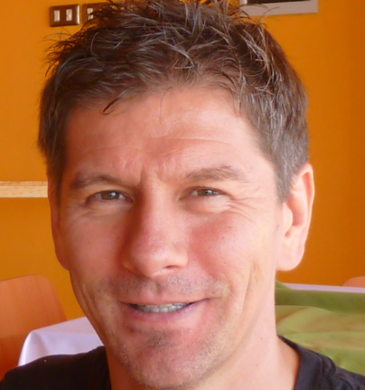


<a class="btn btn-lg btn-secondary me-3 mb-4" href="cv.fr.pdf">
  [Français] CV Téléchargement <i class="fa-regular fa-newspaper"></i>
</a>



{}
 
 
 
 

 

# Michael Bright

**Formateur technique · Consultant · Conférencier**

Perpignan, France · Anglais et français · cv@mjbright.net · https://www.mjbright-training.eu · https://linkedin.com/in/mjbright · https://mjbright.github.io/Talks

## Profil

Formateur technique et consultant bilingue avec plus de 35 ans d'expérience en logiciel, cloud, télécoms et ingénierie des infrastructures. Depuis 2018, je conçois et anime des formations, ateliers et missions de conseil autour de Kubernetes, Terraform, Ansible, Docker et de la gestion des politiques.

Ma pédagogie associe explications ciblées, travaux pratiques réalistes, diagnostic d'incidents et retours directs. J'interviens auprès d'ingénieurs, d'équipes plateforme, de clients grands comptes et de partenaires de formation, en français ou en anglais.

## Domaines de formation

- **Kubernetes :** administration, développement, dépannage, OpenShift et pratiques cloud native
- **Sécurité et gestion des politiques :** concepts de policy Kubernetes et mise en œuvre (OPA, Kyverno, VAP/MAP)
- **Infrastructure as Code:** Terraform/OpenTofu, Crossplane pour automisation AWS et Azure automation
- **Gestion de configuration :** Ansible et provisionnement reproductible
- **Conteneurs :** Docker et fondamentaux de l'orchestration
- **Compétences connexes :** Linux, OpenStack, Vagrant, Vault et platform engineering

## Offre de formation et de conseil

- Formations présentielles ou à distance, ateliers pratiques et accompagnement technique
- Parcours adaptés aux publics débutants, intermédiaires et avancés
- Interventions en direct ou via des partenaires de formation
- Conseil en mise en œuvre de Kubernetes et d'OPA
- Présentations clients, démonstrations techniques et conférences

## Certifications

- **CNCF CKA — Kubernetes Administrator**, 2020 - 2028
- **CNCF CKAD — Kubernetes Application Developer**, 2019 - 2027
- **CNCF KCNA — Kubernetes Cloud Native Associate**, 2022 - 2028
- **CNCF KCSA — Kubernetes Cloud Security Associate**, 2026 - 2028
- **HashiCorp Terraform Associate (TFA-004)**, 2020 - 2028
- **HashiCorp Vault Associate (TFA-003)**, 2022 - 2027
- **Linux Foundation LFCS — Linux Foundation Certified System Administrator**, 2023
- **Microsoft AZ-104 — Azure Administrator**, November 2021
- Previous: HPE ExpertONE SDN Apps; Red Hat RHCE/RHCSA

## Expérience professionnelle

### Formateur technique et consultant — @mjbright Consulting

**2018 – aujourd'hui · France / interventions internationales**

- Formateur Freelance pour Linux Foundation et HashiCorp
- Conçoit et anime des formations Kubernetes, gestion des politiques, Docker, Terraform et Ansible.
- Construit des laboratoires et ateliers pratiques autour de l'exploitation cloud native, de l'Infrastructure as Code et de l'automatisation.
- Accompagne la mise en œuvre de Kubernetes et d'OPA.
- Intervient directement chez les clients ou via des partenaires spécialisés.
- Présente des sujets techniques lors d'événements et de meetups ; voir [mjbright.github.io/Talks](https://mjbright.github.io/Talks).

### Architecte solutions — HPE Customer Innovation Center

**2013 – 2018 · Grenoble, France**

- Pilotage de preuves de concept OpenShift et de présentations cloud native pour les clients.
- Conception et animation de laboratoires d'orchestration de conteneurs.
- Gestion de preuves de concept avec des partenaires NFV et des environnements OpenStack.
- Automatisation d'environnements cloud avec AWS, Terraform, Heat, Ansible et Vagrant.

### Ingénieur cloud — HP CMS

**2005 – 2013 · Grenoble, France**

- Contribution à un brevet européen sur la facturation de données prépayées (**EP1720335A1**).
- Automatisation de l'installation d'un produit AP4SaaS/IaaS pour des opérateurs télécoms.
- Mise en place de tests automatisés pour un produit cloud IaaS.
- Développement agile sur des plateformes d'analyse de données et de profils de services.
- Création d'une démonstration Auto-VideoXML pour le Mobile World Congress.

### Architecte solutions / consultant — HP OCBU

**1998 – 2005 · Grenoble, France**

- Conseil technique avant-vente et réalisation de preuves de concept pour les produits OpenCall.
- Relation clients et partenaires et accompagnement de prestations ITSM.

### Responsable technique / ingénieur logiciel — HP OCBU

**1992 – 1998 · Grenoble, France**

- Responsable technique et ingénieur logiciel sur des produits de réseau intelligent télécom.

### Membre de l'équipe technique — HP Research Labs

**1985 – 1992 · Bristol, Royaume-Uni**

- Recherche sur la modélisation des réseaux X.25, SS7 et LAN, menant à des démonstrateurs et à des produits.
- Travaux sur le traitement parallèle, l'intelligence artificielle et le raisonnement qualitatif.

### Stagiaire de recherche — BBC Research Labs

**1983 – 1984 · Royaume-Uni**

- Recherche sur la réduction subjective du bruit pour l'audio numérique NICAM.
- Conception de filtres Z, simulation des approches de traitement du signal et codage d'une implémentation sur microprocesseur bit-slice.
- Réalisation de tests de perception utilisateurs.

## Formation

**B.Sc. / Dip.Eng. en électronique, commande et robotique — University of Hull**  
1980 – 1985 · Prix Walter Firth d'électronique · Année de stage aux BBC Research Labs

## Langues

- Anglais et Français — courant
- Espagnol et Italien — notions

## Vie professionnelle et associative

- Organisateur de meetup
- Veille et apprentissage continus
- Course à pied et vélo

{}
