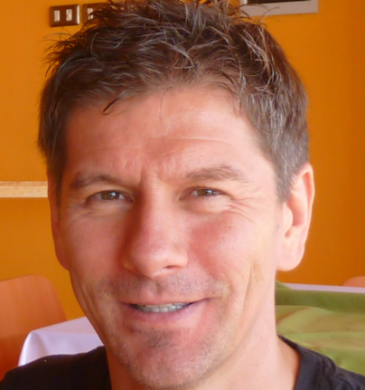



<a class="btn btn-lg btn-secondary me-3 mb-4" href="cv.fr.pdf">
  [Français] CV Téléchargement <i class="fa-regular fa-newspaper"></i>
</a>



{}

{}>

<!--  -->

{}

 
<h1 class="name">
<strong> Michael Bright </strong>  

<strong>Formateur Freelance, Consultant, Conférencier </strong>

</h1>
 
<h2 class="supertitle"> MOTIVATIONS </h2>

Passionné par les nouvelles  
technologies et leurs transmission 

<h2 class="uppertitle"> CONTACT </h2>

<b>email:</b> &nbsp;&nbsp;&nbsp;&nbsp; <a class="cv" href="mailto:cv@mjbright.net">
cv@mjbright.net </a>  
<b>web</b> &nbsp;&nbsp;&nbsp;&nbsp;&nbsp;&nbsp;&nbsp; <a class="cv" href="https://mjbright-training.eu">
https://mjbright-training.eu </a>  
<b>linkedin</b>&nbsp; <a class="cv" href="https://www.linkedin.com/in/mjbright/" target="_blank">
linkedin/in/mjbright </a> 
<b>location:</b>
Perpignan, France  
<b>mobile:</b>&nbsp;&nbsp;
sur demand

<h2 class="uppertitle"> ACTIVITÉS </h2>

• Organisateur de Meetup 
• Continuous Learner  
• Course à pied, vélo 

<h2 class="uppertitle"> COMPÉTENCES </h2>

<b> • Langues:</b> &nbsp;&nbsp;&nbsp;&nbsp;&nbsp; English, French fluency, notions Spanish, Italian  
<b> • Programmation:</b> Python, C++/C, Java, .. many  
<b> • Paradigmes:</b> 
Container Orch, Policy Mgmt, IaC, Ansible, ...  

<h3 class="title"> Certifications </h3>
<ul>
<li> <b>fev&nbsp;&nbsp;&nbsp; 24</b>&nbsp;&nbsp;&nbsp;&nbsp;&nbsp; CNCF CKA: Kubernetes Administrator </li>
<li> <b>fev&nbsp;&nbsp;&nbsp; 24</b>&nbsp;&nbsp;&nbsp;&nbsp;&nbsp; CNCF CKAD: Kubernetes Developer </li>
<li> <b>août 23</b>&nbsp;&nbsp;&nbsp;&nbsp;&nbsp; LinuxFoundation LFCS </li>
<li> <b>juil &nbsp;&nbsp;&nbsp;23</b>&nbsp;&nbsp;&nbsp;&nbsp;&nbsp;&nbsp; TFA003 Terraform Associate </li>
<li> <b>déc&nbsp;&nbsp; 22</b>&nbsp;&nbsp;&nbsp;&nbsp;&nbsp; HCVAO-002 Vault Associate </li>
<li> <b>nov&nbsp;&nbsp; 21</b>&nbsp;&nbsp;&nbsp;&nbsp;&nbsp;&nbsp; AZ-104 Azure Administrator </li>
<li> <b>Previous:</b>&nbsp;&nbsp;HPE Expert One SDN Apps, RedHat RHCE/RHCSA </li>
</ul>
<h2 class="uppertitle"> EXPÉRIENCE PROFESSIONNELLE </h2>
<h3 class="title">
07/2018 - Présent: Formateur technique, Consultant 
&nbsp;&nbsp;&nbsp;&nbsp;@mjbright Consulting 
</h3>
<ul>
<li><b>Formations/ateliers:</b> </li>
<ul>
<li> Kubernetes, Policy Management, Docker </li>
<li> Infra as Code: Terraform/AWS/Azure, Ansible </li>
</ul>
<li><b>Livraison:</b> direct or through partners </li>
<li><b>Consulting:</b> Kubernetes, OPA Implementation </li>
<li> <b>Conférencier:</b></b>
<a href="https://mjbright.github.io/Talks" > https://mjbright.github.io/Talks </a>
</li>
</ul>
<h3 class="title">
09/2013 - 06/2018: Solution Architect 
&nbsp;&nbsp;&nbsp;&nbsp;HPE Customer Innovation Center - Grenoble, France 
</h3>
<ul>
<li>Gestion de PoC OpenShift </li>
<li>Presentations client - Cloud Native </li>
<li>Labs "Container Orchestration" </li>
<li>Gestion de PoC avec NFV partners, OpenStack </li>
<li>Automisation Cloud (AWS, Terraform, Heat, Ansible, Vagrant) </li>
</ul>
<h3 class="title"> 09/2005 - 09/2013: Cloud Engineer 
&nbsp;&nbsp;&nbsp;&nbsp;HP CMS - Grenoble, France  </h3>
<ul>
<li>Brevet UE "Prepaid data charging" [EP1720335A1] </li>
<li>Auto-install produit AP4SaaS/IaaS pour Telecom service providers </li>
<li>Auto-test produit IaaS </li>
<!-- <li>Développement agile - plateforme "Data Analytics & Service Profile"</li> -->
<li>Dév agile - plateforme "Data Analytics & Service Profile"</li>
<li>Création demo MWC: Auto-VideoXML dialog </li>
</ul>
<h3 class="title"> 02/1998 - 09/2005: Solution Architect/Consultant 
&nbsp;&nbsp;&nbsp;&nbsp;HP OCBU - Grenoble, France  </h3>
<ul>
<li>Pre-sales technical consulting sur produits OpenCall, PoCs </li>
<li>Contact client/partenaire & ITSM delivery </li>
</ul>
<h3 class="title"> 05/1992 - 02/1998: Technical Lead/Ingénieur logiciel 
&nbsp;&nbsp;&nbsp;&nbsp;HP OCBU - Grenoble, France  </h3>
<ul>
<li>Technical Lead sur produits Telecom IN </li>
<li>Ingénieur logiciel </li>
</ul>
<h3 class="title"> 08/1985 - 05/1992: Member of Technical Staff 
&nbsp;&nbsp;&nbsp;&nbsp;HP Research Labs - Bristol UK  </h3>
<ul>
<li>Chercheur: Network (X.25, SS7, LAN) modelling
<ul><li>leading to PoC demos & products </li></ul>
</li>
<li>Chercheur: Parallel Processing , AI/Qualitative reasoning </li>
</ul>
<h3 class="title"> 09/1983 - 08/1984: Research Trainee 
&nbsp;&nbsp;&nbsp;&nbsp;BBC Research Labs - UK  </h3>
<ul>
<li>Chercheur: "NICAM digital audio" réduction subjective du bruit.
<ul>
<li>Conception Z-filter, simulation, codage bit-slice &mu;-processor
<li>tests de subjectivité utilisateur</li>
</ul>
</li>
</ul>
<h2 class="uppertitle"> ÉDUCATION </h2>
<h3 class="title"> 1980 - 1985: University Of Hull 
&nbsp;&nbsp;&nbsp;&nbsp;B.Sc/Dip.Eng in Electronic Control & Robotics </h3>
<ul>
<li>Walter Firth prize pour electronique </li> <!--   -->
<li>Stage d'un an au BBC Research Labs </li>
</ul>

{}>

